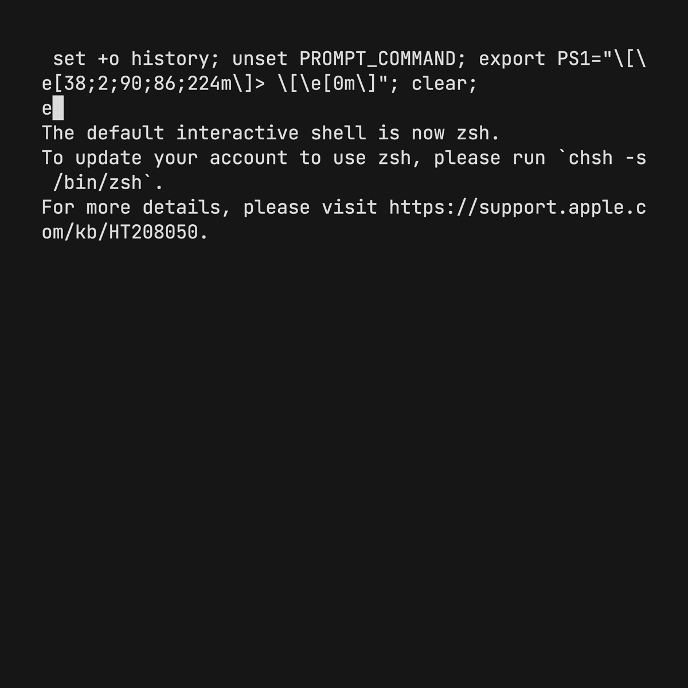

# Sqllogictest-rs

[](https://crates.io/crates/sqllogictest)
[](https://docs.rs/sqllogictest)
[](https://github.com/risinglightdb/sqllogictest-rs/actions)

[Sqllogictest][Sqllogictest] is a testing framework to verify the correctness of an SQL database.

This repository provides two crates:
- `sqllogictest` is a library containing sqllogictest parser and runner.
- `sqllogictest-bin` is a CLI tool to run sqllogictests.

[Sqllogictest]: https://www.sqlite.org/sqllogictest/doc/trunk/about.wiki

## Use the library

To add the dependency to your project:

```sh
cargo add sqllogictest
```

Implement `DB` trait for your database structure:

```rust
struct Database {...}

impl sqllogictest::DB for Database {
    type Error = ...;
    type ColumnType = ...;
    fn run(&mut self, sql: &str) -> Result<sqllogictest::DBOutput<Self::ColumnType>, Self::Error> {
        ...
    }
}
```

Then create a `Runner` on your database instance, and run the tests:

```rust
let db = Database {...};
let mut tester = sqllogictest::Runner::new(db);
tester.run_file("script.slt").unwrap();
```

You can also parse the script and execute the records separately:

```rust
let records = sqllogictest::parse_file("script.slt").unwrap();
for record in records {
    tester.run(record).unwrap();
}
```

## Use the CLI tool



To install the binary:

```sh
cargo install sqllogictest-bin
```

You can use it as follows:

```sh
sqllogictest './test/**/*.slt'
```

This command will run scripts in `test` directory against postgres with default connection settings.

You can find more options in `sqllogictest --help` .

> **Note**
>
> Currently only postgres is supported in the CLI tool.

## `.slt` Test File Format Cookbook

Test files often have the `.slt` extension and use a dialect of Sqlite [Sqllogictest].

Some commonly used features of `sqlparser-rs` are show below, and many more
are illustrated in the files in the [examples](./examples) directory.

### Run a statement that should succeed

```text
# Comments begin with '#'
statement ok
CREATE TABLE foo AS VALUES(1,2),(2,3);
```

### Run a query that should succeed

```text
# 'II' means two integer output columns
# rowsort means to sort the output before comparing
query II rowsort
SELECT * FROM foo;
----
3 4
4 5
```

### Run a statement that should fail

```text
# Ensure that the statement errors and that the error
# message contains 'Multiple object drop not supported'
statement error Multiple object drop not supported
DROP VIEW foo, bar;
```

## Used by

- [RisingLight](https://github.com/risinglightdb/risinglight): An OLAP database system for educational purpose
- [RisingWave](https://github.com/risingwavelabs/risingwave): The next-generation streaming database in the cloud
- [DataFusion](https://github.com/apache/arrow-datafusion): Apache Arrow DataFusion SQL Query Engine
- [Databend](https://github.com/datafuselabs/databend): A powerful cloud data warehouse

## Contributing

Unless you explicitly state otherwise, any contribution intentionally submitted
for inclusion in the work by you, as defined in the Apache-2.0 license, shall be
dual licensed as above, without any additional terms or conditions.

Contributors should add a Signed-off-by line for [Developer Certificate of Origin](https://github.com/probot/dco#how-it-works)
in their commits. Use `git commit -s` to sign off commits.

## License

This project is available under the terms of either the [Apache 2.0 license](LICENSE-APACHE) or the [MIT license](LICENSE-MIT).
